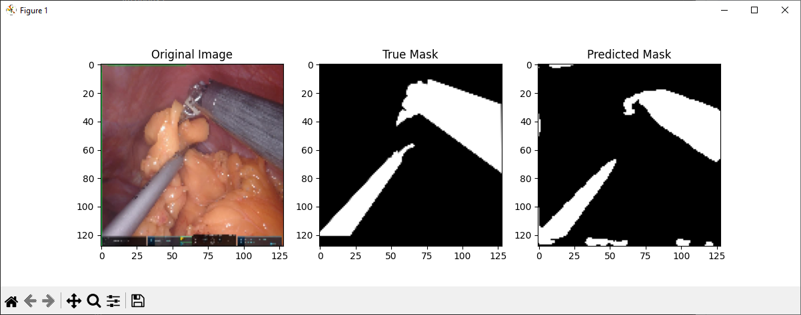

# CISC 352 - Neural and Genetic Computing Final Project

## U-Net Surgical Tool Segmentation

### Setup

Code formatted by [autopep8](https://marketplace.visualstudio.com/items?itemName=ms-python.autopep8).

Requires Python version 3.12.6 for compatibility with Tensorflow.

Dependencies can be installed by executing this command from the src folder of the project:

```
pip install -r requirements.txt
```

### Running

The model can be run by executing this command from the src folder of the project:

```
python3 main.py
```

Alternatively, the epoch info can be viewed directly on GitHub without running locally in the [Actions](https://github.com/adamcockell1/image-segmentation/actions) tab under the `run_model.yml` workflow.

### Results

Predicted mask visually matches reasonably well with true mask.



Tracked metrics from 20 epochs are:
- Accuracy 88.67%
- Loss 27.82
- Mean IoU 0.42

Overall accuracy and especially mean IoU would likely improve with additional images and iterations, as the current sample of 20 is relatively small.

### Dataset

This project uses the [Surgical Scene Segmentation in Robotic Gastrectomy](https://www.kaggle.com/datasets/yjh4374/sisvse-dataset/data) Kaggle dataset.

### Project Documents

The project [proposal](docs/proposal.pdf), [presentation](docs/presentation.pdf), and [report](docs/report.pdf) can be found in the docs folder.